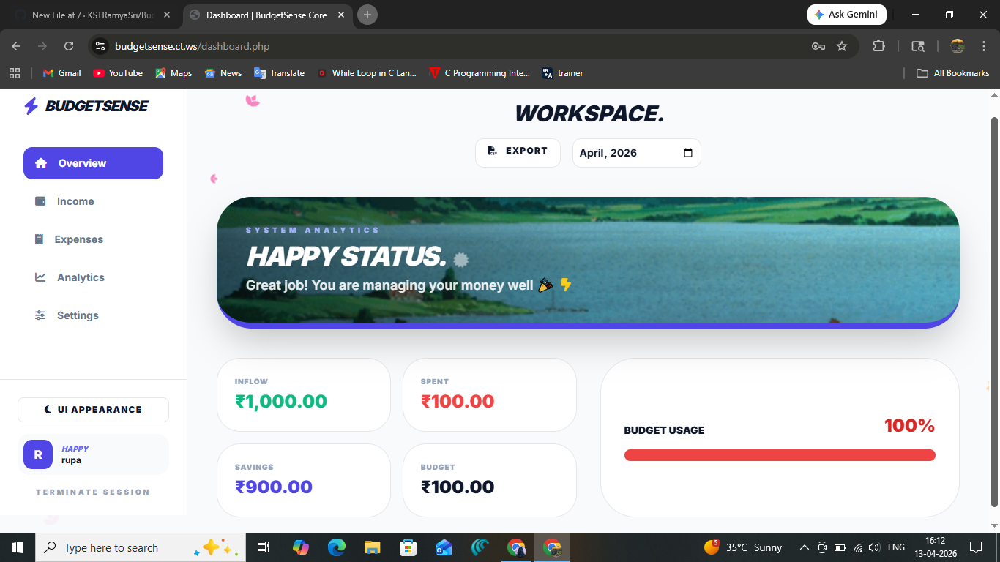
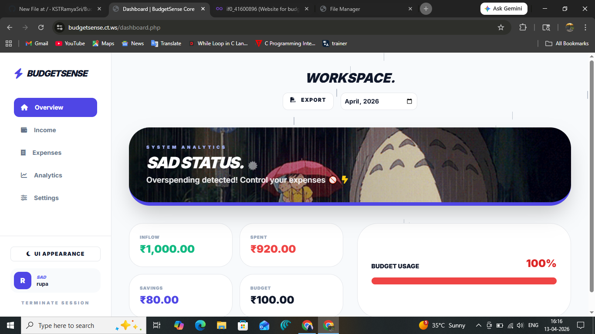
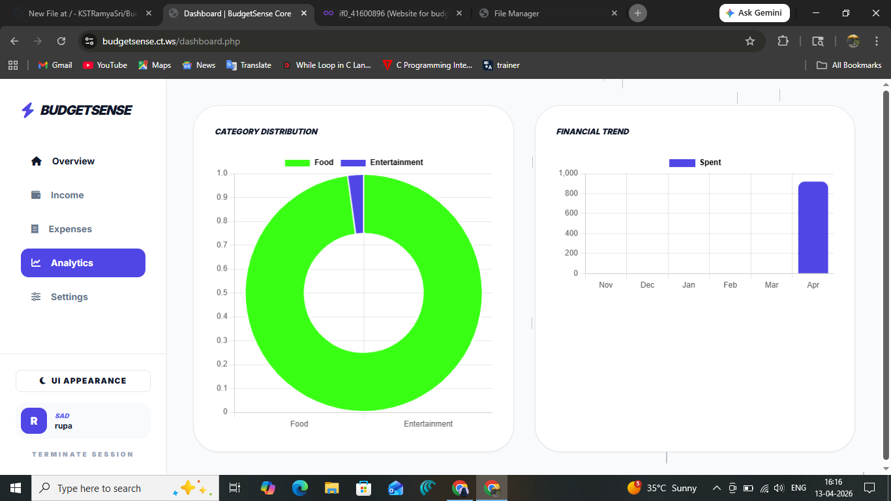
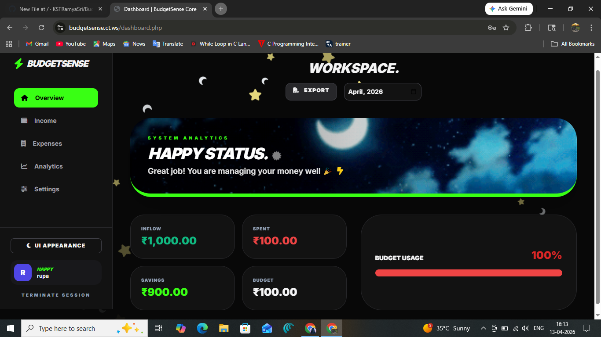

# BUDGETSENSE: STUDENT BUDGETING WORKSPACE
**Design Thinking Laboratory Project | B.Tech Year II Semester II | Pragati Engineering College**

 

*This system is an engineered financial tracking solution developed as a part of the Design Thinking Lab curriculum. It prioritizes a distraction-free environment for students to monitor capital flow, configure threshold parameters, and analyze economic trajectories through an Emotion-based User Interface.*

---

## SYSTEM INTERFACE & SCREENSHOTS

  
  **1. The Welcome Portal**
   
  
    

  **2. Core Dashboard Analytics & States**
   
  

    
    &nbsp;
    
  

   
  

    
  

   
  
  **3. Previous Iteration (Dark Mode Focus)**
   
  

    
  

    

---

## I. PROJECT IDENTITY

| Detail | Description |
| :--- | :--- |
| **Project Title** | Student Budgeting Web Application with Emotion UI |
| **Academic Context** | B.Tech Year 2, Semester 2 |
| **Laboratory** | Design Thinking Lab |
| **Deployment Access** | [budget.ct.ws/welcome.php](http://budget.ct.ws/welcome.php) |

---

## II. DEVELOPMENT TEAM

* **K. S. T. Ramya Sri**
* **N. Param Singh Naik**
* **K. Reshma Srivalli**
* **N. Sampath**

---

## III. CORE SYSTEM PILLARS

> **EMOTION-BASED UI**
> A dynamic interface layer that reflects the user's financial health through atmospheric cues. The workspace atmosphere (backgrounds and icons) shifts between specific states based on current savings and budget adherence.

> **ASSET INGESTION & TRACKING**
> Systematic recording of incoming revenue streams and outflows to establish a comprehensive financial baseline for student life.

> **THRESHOLD CONFIGURATION**
> Implementation of smart budget limits and savings goals tailored to monthly operational requirements, providing real-time alerts upon nearing limit capacity.

---

## IV. TECHNICAL SPECIFICATIONS

### Front-End Architecture
* `TAILWIND CSS`: A utility-first framework utilized for high-performance UI components and responsive layouts.
* `CHART.JS`: Deployed for professional-grade data visualization, including category distribution and spending trends.
* `INTER TYPEFACE`: A high-legibility typeface chosen to ensure financial data clarity across all devices.
* `FONTAWESOME 6`: Professional iconography system for streamlined navigation and status indicators.

### Back-End Infrastructure
* `PHP 8.x`: The core server-side engine driving logic, authentication, and session management.
* `MYSQL`: Relational database management system for secure, structured storage of financial records.
* `AJAX / FETCH API`: Utilized for asynchronous data transactions to ensure state persistence without page reloads.

---

## V. SECURITY & DATA INTEGRITY

* **CREDENTIAL ENCRYPTION:** Implementation of industry-standard hashing for all user authentication data.
* **DATA SANITIZATION:** Rigorous input handling to prevent SQL injection and cross-site scripting (XSS).
* **SESSION GUARDS:** Secure session management to maintain authorized access and protect student data.

---

## VI. OPERATIONAL WORKFLOW

1. **INITIALIZE:** User registration and configuration of the unique security key.
2. **INGEST:** Daily logging of transactions via the professional entry modals.
3. **ANALYZE:** Real-time generation of analytics including doughnut charts for categories and bar graphs for trends.
4. **MONITOR:** Observation of the Emotion UI to gauge financial status at a glance.

---

  <strong>DESIGNED FOR PRECISION. ENGINEERED FOR FINANCIAL GROWTH.</strong>

